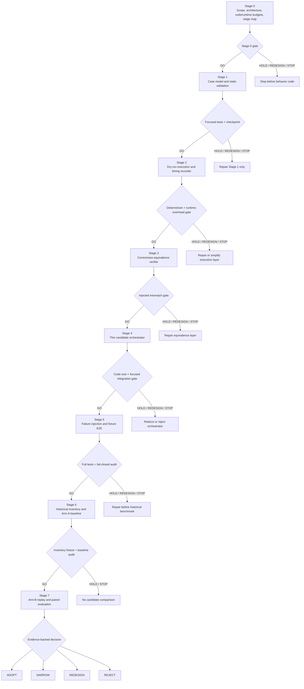

# Development Workflow Optimization Implementation Plan

**Claim:** `GOV-DEV-WORKFLOW-OPTIMIZATION-BENCHMARK-01`  
**Branch:** `dev/gov-dev-workflow-optimization-benchmark-01`  
**Initial base:** `main@7d0ecfbee3b9e44bbad97fb806c8806b604f75f6`  
**Current main observed during Stage 0 review:** `3e56a2b27c76779a2f80e45dd003934666cf37bd`  
**Status:** Stage 0 active; staged disposable-prototype implementation authorized on the development branch; no default-route change

## 1. Engineering-size estimate

This is a medium repository-tool project. It is not a service, platform, daemon, workflow engine, or replacement authority.

Estimated active engineering effort:

| Workstream | Estimate |
|---|---:|
| Scope, architecture, and case-contract freeze | 1–2 h |
| Core replay/orchestration implementation | 6–8 h |
| Unit, integration, and failure-injection tests | 4–6 h |
| Historical case reconstruction and repeated replay | 4–8 h |
| Review, simplification, and documentation sync | 2–3 h |
| **Total active effort** | **15–24 h** |

Unattended test and replay execution may add several hours of elapsed machine time. Missing historical local artifacts can increase case-reconstruction effort but must not justify expanding the core architecture.

### 1.1 Production-code budget assessment

The line budget applies to all newly added non-test Python production code under `src/drpo/workflow_replay/` and `scripts/run_workflow_replay.py`, excluding blank lines and comments only when the line-count report states the exact method used.

The current architecture supports the following rough allocation:

| Responsibility | Expected production lines |
|---|---:|
| Case model and strict validation | 70–100 |
| Arm execution and event recording | 110–150 |
| Correctness equivalence and paired comparison | 90–130 |
| CLI and thin orchestration | 50–80 |
| **Expected total** | **320–460** |

Frozen budget policy:

- **preferred target:** 350–450 production lines;
- **yellow review zone:** 451–500 production lines; the next step is blocked until duplication, abstractions, and error paths are reviewed and a written justification is recorded;
- **hard stop:** more than 500 production lines requires redesign or cancellation before further behavior is added;
- test and fixture code may be larger because correctness equivalence and failure replay are the main evidence burden;
- no new third-party dependency;
- no database, dashboard, service, daemon, queue, scheduler, or blocking CI.

The budget is an anti-framework constraint, not a reason to omit necessary validation or compress code into unreadable forms. A candidate that only fits by weakening error handling or combining unrelated responsibilities fails the architecture review.

### 1.2 Runtime-cost budget

Runtime cost is a first-class acceptance criterion. A workflow optimizer that reduces manual steps but adds equal or greater machine time is a negative optimization unless that cost is explicitly justified by a separately measured avoided risk. No such exception is pre-authorized for this iteration.

The benchmark records three different quantities:

- **underlying component time:** elapsed time inside the existing fastpath, V1 stages, authority, and selected gates;
- **candidate self-overhead:** parsing, planning, status inspection, file placement, event recording, and summary generation performed by the new layer outside child-command execution;
- **controlled end-to-end time:** total replay time for Arm A or Arm B, including the same required underlying components.

Frozen runtime rules:

1. Arm B may not invoke an existing component, gate, repository scan, or network operation more times than Arm A unless the replay case itself predeclares the same recovery action for both arms.
2. The candidate may not rerun validators or gates merely to manufacture telemetry; it must consume existing machine records whenever possible.
3. Static manifest validation, command planning, `status`, and summary generation target a median of at most `250 ms` and a p95 of at most `1 s` on the frozen replay environment.
4. Candidate self-overhead for one successful replay targets a median of at most `1 s`. More than `2 s` or more than `2%` of the Arm-A median, whichever is larger, enters runtime yellow review. More than `5 s` of self-overhead, duplicate full scans, or any candidate-caused material per-case slowdown triggers redesign.
5. Total Arm-B time must still satisfy the stricter paired no-regression and adoption rules. Low self-overhead does not excuse a slower end-to-end path.
6. Runtime overhead must be measured from monotonic event boundaries. It may not be estimated by subtracting unrelated historical PR wall time.
7. Warm-cache gains may not hide orchestration cost: A and B use the same cache policy and opposite execution order.

These thresholds are provisional engineering guardrails frozen before implementation. They may be tightened after evidence, but may not be relaxed after candidate results merely to obtain adoption.

## 2. Architecture

The implementation is split into independently testable modules. No module may assume ownership of another component's domain logic.

### Module A — case contract and fixture loader

Responsibility:

- parse and strictly validate one immutable replay-case manifest;
- bind historical task identity, shared benchmark toolchain identity, expected outputs, gates, cache policy, and replayability class;
- reject unknown keys, mutable paths, post-hoc exclusions, or ambiguous terminal states.

Does not:

- execute V1;
- interpret scientific results;
- mutate repository state.

### Module B — arm execution adapter

Responsibility:

- run Arm A or Arm B using the same frozen inputs and environment;
- invoke existing fastpath and V1 commands rather than reimplementing them;
- record monotonic stage timestamps, exit status, terminal state, commands, file-placement events, and diagnostics;
- support isolated workspaces and deterministic reruns.

Does not:

- auto-repair failures;
- weaken gates;
- push, create PRs, approve, or merge.

### Module C — correctness-equivalence verifier

Responsibility:

- compare successful outcomes by tree, changed paths, file modes, registry semantic hash, handoff/materialization state, delta semantics, authority result, selected gates, gate conclusions, terminal state, and provenance;
- compare failed outcomes by safety boundary, diagnostics, lack of partial mutation, and recovery class;
- block all efficiency claims until equivalence passes.

Does not:

- redefine authority semantics;
- accept approximate scientific equivalence.

### Module D — timing and operation recorder

Responsibility:

- emit append-only raw events for wall time, underlying component time, candidate self-overhead, and active operation time;
- distinguish operator/model-active intervals from unattended command execution;
- record cache policy, order, repetition, invalidation reason, and environment fingerprint;
- preserve every raw repetition.

Does not:

- create a telemetry service;
- persist a database;
- hide outliers;
- cause duplicate component or gate execution merely to collect measurements.

### Module E — paired comparison and decision

Responsibility:

- aggregate per-arm medians across opposite-order repetitions;
- trigger a third repetition when variation exceeds the frozen threshold;
- calculate per-case and aggregate time reduction, active-time reduction, command reduction, runtime self-overhead, and complexity cost;
- emit `ADOPT`, `NARROW`, `REDESIGN`, or `REJECT` only from frozen rules.

Does not:

- change the default route;
- treat a tie as an improvement;
- exclude a poor case after results are known.

## 3. Milestone effort and delivery plan

The estimates below are active engineering time, not calendar promises. Unattended CI and replay execution are reported separately.

| Step | Deliverable | Active estimate | Cumulative estimate |
|---|---|---:|---:|
| 0 | Scope, architecture, code/runtime budgets, stage map, checkpoint policy | 1–2 h | 1–2 h |
| 1 | Case model, schema, positive/negative fixtures | 2–3 h | 3–5 h |
| 2 | Dry-run execution adapter and event recorder | 2–3 h | 5–8 h |
| 3 | Correctness-equivalence verifier | 2–3 h | 7–11 h |
| 4 | Thin Arm-B orchestrator | 2–3 h | 9–14 h |
| 5 | Failure injection and fixture end-to-end replay | 2–4 h | 11–18 h |
| 6 | Historical inventory and Arm-A baseline replay | 3–5 h | 14–23 h |
| 7 | Arm-B replay, comparison, review, and decision | 2–4 h | 16–27 h |

The original 15–24 hour estimate remains the planning center. The broader 16–27 hour milestone envelope explicitly includes checkpoint reporting and allows for historical fixture variance. Crossing 27 active hours triggers an ROI review before additional implementation.

### 3.1 Stage map



### 3.2 Current stage ledger

| Stage | Status | Durable evidence | Next gate |
|---|---|---|---|
| 0 | `active` | this plan, scope, PR #103, Stage-0 PR report | exact-head checks, changed-path review, runtime-budget review |
| 1 | `not_started` | none | Stage-0 `GO` |
| 2 | `not_started` | none | Stage-1 checkpoint and focused tests |
| 3 | `not_started` | none | Stage-2 checkpoint and runtime-overhead evidence |
| 4 | `not_started` | none | Stage-3 correctness-equivalence checkpoint |
| 5 | `not_started` | none | Stage-4 code-size and integration checkpoint |
| 6 | `not_started` | none | Stage-5 failure-injection/full-test checkpoint |
| 7 | `not_started` | none | frozen inventory and audited Arm-A baseline |

The ledger is updated only at a stage boundary. PR #103's latest stage report contains the exact checkpoint SHA and takes precedence over a stale table entry if a documentation update is awaiting CI.

## 4. Staged development plan

### Step 0 — implementation scope and skeleton

Goal:

- record implementation authorization;
- freeze module boundaries, file layout, code budget, runtime-cost budget, milestone estimates, stage map, checkpoint policy, and stage gates;
- record current-main movement and applicable repository-wide gates;
- create no behavior-changing code.

Exit gate:

- documents are internally consistent;
- runtime cost is measured separately from underlying component time and historical PR time;
- the stage diagram and cross-session handoff rules are committed;
- current `main` is resolved and any relevant new gate is recorded;
- no scientific, authority, V1-core, registry-schema, workflow, or merge behavior changes;
- exact-head applicable GitHub checks pass.

Current repository-wide constraint: `main@3e56a2b27c76779a2f80e45dd003934666cf37bd` adds `GOV-CODE-CHANGE-BUDGET-01`. Any Python file addition or Python churn above 100 lines triggers the `large-code-change-approval` environment. This is expected for Stage 1 and later; it must not be bypassed by artificial file splitting, minification, or moving Python behavior into unrelated file types.

### Step 1 — case model and static validation

Goal:

- implement Module A;
- define a minimal case-manifest schema;
- create representative positive and negative fixture manifests.

Exit gate:

- focused unit tests pass;
- unknown keys, unsafe paths, invalid SHAs, missing expected outcomes, ambiguous scope, and post-hoc exclusions fail closed;
- no subprocess or repository mutation occurs;
- static validation and planning overhead satisfy the Stage-0 runtime guardrails;
- the code-change-budget approval path, when triggered, completes normally.

### Step 2 — execution recorder and dry-run adapter

Goal:

- implement Modules B and D in dry-run/fixture mode first;
- produce deterministic command plans and append-only raw event records;
- prove Arm A and Arm B receive identical frozen inputs;
- measure candidate self-overhead independently from child-command time.

Exit gate:

- no existing component core is modified;
- command planning is deterministic and idempotent;
- interrupted fixture runs remain diagnosable and do not claim terminal success;
- no duplicate child command, gate, scan, or network operation is introduced;
- measured self-overhead is within the Stage-0 runtime budget or receives a documented `REDESIGN` decision.

### Step 3 — correctness-equivalence verifier

Goal:

- implement Module C;
- support both successful and fail-closed replay outcomes;
- verify protected semantic equality before timing analysis.

Exit gate:

- injected tree, registry, delta, authority, gate, terminal-state, and provenance mismatches are detected;
- efficiency output is impossible when correctness equivalence fails.

### Step 4 — thin candidate orchestrator

Goal:

- implement the smallest Arm B composition path;
- connect existing preparation and V1 stages without duplicating their validators or state;
- remove manual intermediate placement for covered cases.

Exit gate:

- production code remains in the preferred 350–450 line range, or enters the documented yellow review before proceeding;
- no new third-party dependency;
- no V1 core, authority, registry schema, scientific code, GitHub workflow, publication, or merge change;
- focused integration tests pass;
- the orchestrator adds no duplicate component invocation and remains within the runtime self-overhead budget.

### Step 5 — failure-injection and end-to-end fixture replay

Goal:

- cover main drift, before-image mismatch, gate failure, interruption, output conflict, and mutated reviewer approval;
- run opposite-order paired fixture replays;
- validate raw-result and decision artifacts.

Exit gate:

- zero correctness/safety regression;
- every failure remains fail closed;
- no partial authority/scientific mutation;
- full repository tests and Ruff pass at exact head.

### Step 6 — historical replay inventory and baseline

Goal:

- freeze 6–10 representative cases before candidate results;
- reconstruct immutable inputs and classify replayability;
- run accepted Arm A baselines under the shared toolchain.

Exit gate:

- case inventory is fixed;
- no poor or difficult case is removed post hoc;
- raw repetitions, invalidations, and missing-artifact limitations are preserved.

### Step 7 — candidate replay, evaluation, and review

Goal:

- run Arm B on the identical case inventory;
- perform repeated `A→B` and `B→A` comparisons;
- evaluate all frozen correctness, no-regression, runtime-overhead, complexity, and adoption thresholds;
- conduct architecture, correctness, ROI, and anti-framework review.

Exit gate:

- one evidence-backed decision is recorded;
- every material slowdown is explained and blocks universal adoption unless the task class was predeclared out of scope;
- a failing candidate is narrowed, redesigned, or rejected rather than rationalized;
- no merge or default-route activation occurs without a new explicit user approval.

## 5. Expected repository shape

The preferred implementation shape is:

```text
src/drpo/workflow_replay/
  model.py
  execute.py
  compare.py
scripts/run_workflow_replay.py
tests/
  test_workflow_replay_model.py
  test_workflow_replay_execute.py
  test_workflow_replay_compare.py
  fixtures/workflow_replay/
```

This is a target, not permission to fill every file with a separate framework. Modules may be collapsed when that reduces total code and state while preserving test isolation.

## 6. GitHub checkpoint and stage-report protocol

Every completed step must be persisted on `dev/gov-dev-workflow-optimization-benchmark-01` before the next step begins.

### 6.1 Checkpoint commit

Each step normally produces one logical checkpoint commit after its exit gate passes. A corrective follow-up commit is allowed when review finds a defect, but partial or known-broken work must not be presented as a completed milestone.

The checkpoint commit must contain only the step's frozen changed paths plus necessary documentation/status updates. It must not change scientific state or widen the next step implicitly. Current-main movement is audited at every boundary. A main change that affects in-scope components forces `HOLD` and an explicit rebase/rebuild decision; an unrelated change is recorded and the exact-head PR checks remain authoritative.

### 6.2 Draft PR remains the durable work record

PR #103 remains Draft throughout prototype development. It is the durable review and progress record, but its Draft status does not authorize merge or default-route activation.

After each checkpoint, the PR receives a stage report containing:

- step number and goal;
- checkpoint commit SHA;
- current `main` SHA and ahead/behind status;
- files added or changed;
- production/test/fixture line counts;
- tests actually executed and their exact result;
- active engineering time and unattended machine time, reported separately;
- measured candidate self-overhead when behavior code exists;
- discovered defects and how they were resolved;
- unresolved blockers or uncertainties;
- scope drift assessment;
- `GO`, `HOLD`, `REDESIGN`, or `STOP` decision for the next step.

### 6.3 Reporting cadence

A user-facing progress report is issued at every step boundary, not after every small edit. The report must not claim a step is complete until its code and evidence are committed to GitHub and the applicable tests have actually passed.

A step that is blocked is also reported immediately with its checkpoint or last-known-good SHA, the blocking condition, and whether the next step is prohibited.

### 6.4 Preservation and recovery

The development branch and Draft PR are the recovery source for completed milestones. Large local replay workspaces may remain outside GitHub, but every retained checkpoint must record their hashes and locators in the minimal benchmark artifacts. No essential source code, fixture manifest, comparison result, or decision may exist only in chat or an untracked local directory.

The final accepted implementation, if any, may later be rebuilt as a clean integration candidate from the reviewed checkpoint. This branch preserves development and benchmark history; it is not automatically the final merge shape.

### 6.5 Cross-session continuation protocol

A session continuing this project must:

1. read repository `AGENTS.md` and `docs/handoff.md` Section 0 first;
2. read `experiments/registry.yaml` without treating this engineering benchmark as a scientific experiment;
3. read `docs/development_workflow_optimization/README.md`, `REPLAY_BENCHMARK_PROTOCOL.md`, this plan, and the scope file;
4. read PR #103's latest stage report and resolve the branch head and current `main` through GitHub;
5. compare current `main` with the recorded checkpoint and inspect any intervening changes relevant to fastpath, V1, authority, tests, or governance gates;
6. resume only the single next authorized stage shown by the latest `GO` decision;
7. preserve unfinished work as Draft and never infer completion from file presence alone.

The stage diagram, ledger, checkpoint commit, PR report, and exact-head CI together form the cross-session handoff. Chat history is optional context, not authority.

## 7. Per-step review rule

Every step must have:

1. one explicit goal;
2. one frozen changed-path scope;
3. focused tests tied to that goal;
4. a changed-path and line-count review;
5. a runtime-cost review once behavior code exists;
6. confirmation that no prior accepted behavior regressed;
7. a checkpoint commit and PR stage report;
8. a stop decision before the next step.

A later step may not silently repair an earlier step by adding cross-module special cases. The earlier module must instead be corrected and retested.

## 8. Stop and redesign conditions

Stop implementation and review the architecture when any of the following occurs:

- production code exceeds 500 lines;
- production code enters 451–500 lines without a recorded yellow-zone review;
- active effort exceeds 27 hours without a fresh ROI decision;
- candidate self-overhead exceeds the runtime hard review threshold or a duplicate gate/scan/network operation appears;
- any in-scope case is materially slower because of the candidate;
- a new dependency, service, database, queue, scheduler, state machine, or dashboard appears necessary;
- V1 core or handoff authority would need modification;
- task-specific E7/E8 branches appear in general workflow code;
- the candidate needs automatic push, PR creation, approval, or merge to show benefit;
- correctness equivalence cannot be stated independently of timing;
- historical fixture reconstruction becomes larger than the workflow optimization itself;
- a simpler documentation or command-wrapper change solves the same measured problem.

## 9. Current next action

Stage 0 remains `active` until this runtime budget, stage map, cross-session protocol, current-main constraint, changed paths, and exact-head checks are reviewed. After a Stage-0 PR report records `GO`, the only next implementation action is Stage 1. Stage 2 does not begin until the case contract and focused tests are committed, reported, and reviewed. No scientific experiment execution is part of this plan.
