# Generated Claim--Experiment View

Graph hash: `2f394798ef542770d1056830d925d22ab637473bb086b8f61f502655e2f90205`

> Generated from accepted edges only. Pending semantic suggestions remain in REVIEW_QUEUE.yaml.

```mermaid
flowchart LR
  n_31220683b4ee["The four approved E4-TAPER follow-ups remain blocked and must execute in the frozen order: near-rete"]
  n_160bc66075a8["Steady-state, collapse, and method-ranking claims require terminal-state auditing rather than arbitr"]
  n_e02b1aa584bf["EXT-C/Countdown provides token-level discrete external validation rather than replacing D-U1."]
  n_93128d5421b6["C-U1 E1 identifies far-field score geometry as an independent source of larger negative gradients at"]
  n_707c42ed88f4["C-U1 E3 long-run evidence supports far-field negative gradients as the causal path to task collapse "]
  n_6e543aa69f86["D-U1 E5 long-run evidence validates bounded-score repeated repulsion and categorical support-boundar"]
  n_083a4a1007fc["D-U1 E6 validates a non-monotonic benefit of controlled local negative signals and a semantic-alignm"]
  n_237e5cc010a0["Under bounded-advantage, pre-boundary learnable-log-scale assumptions, reciprocal-quadratic weightin"]
  n_bc8cd768c956["Outside the locally informative region, expected negative-sample net utility is hypothesized to be g"]
  n_feef39560333["Historical Hopper evidence is an external mechanism validation, not a normalized-return method table"]
  n_8779f773aadc["EXT-H/Hopper provides learned-critic external mechanism and method validation rather than controlled"]
  n_ed9ebb420865["Controlled negative gradients can beat the positive-only ceiling while anomalous far-field negatives"]
  n_19b9968ab5ef["The method narrative is remoteness control under a stability-generalization trade-off; hard filterin"]
  n_4f7c98612a3a["gaussian_output_score_componentwise_growth_law"]
  n_9bf465ebee47["cu1_far_field_causal_intervention_unified_adam"]
  n_8a45c33d6842["cu1_stable_extrapolation_phase_transition_unified_adam"]
  n_bec19d99aedd["cu1_e4_fixed_variance_long_horizon_terminal_confirmation"]
  n_b306a2ad51e7["standardized_distance_taper_order_formal_comparison"]
  n_905447bbda84["taper_family_negative_update_budget_matched_comparison"]
  n_684cc40787c6["taper_frozen_protocol_independent_seed_confirmation"]
  n_03f052b4695b["taper_frozen_shortlist_long_run_terminal_resolution"]
  n_5bb3c13685ab["taper_family_near_negative_retention_matched_comparison"]
  n_78005eca51fb["categorical_repulsion_support_boundary_longrun_reconstruction"]
  n_d30db95bf5c2["structured_conditional_support_gap_categorical_longrun"]
  n_3fad2f9fa7e6["minimum_change_shared_semantic_conditional_gap_longrun"]
  n_e1319c105cb4["shared_semantic_categorical_extrapolation_longrun"]
  n_18a6128df7c5["countdown_large_model_large_data_external_benchmark"]
  n_7053964987d2["countdown_base_first_transformer_external_validation"]
  n_f7f058af94f2["countdown_audited_base_first_transformer_external_validation"]
  n_e7cdb0f7970d["countdown_balanced_offline_dynamic_far_field_external_validation"]
  n_513963b1392c["countdown_policy_relative_dynamic_negative_control_pilot"]
  n_265054fdd670["countdown_fixed_offline_negative_bank_dynamic_selection_pilot"]
  n_aba311814f70["countdown_offline_bank_alpha_lambda_validation_tuning_pilot"]
  n_202ee82e9a9b["d4rl_mujoco_locomotion_method_benchmark"]
  n_becbcc786154["hopper_gaussian_log_scale_quadratic_external_validation"]
  n_d30db95bf5c2 -->|tests| n_083a4a1007fc
  n_aba311814f70 -->|external_validates| n_e02b1aa584bf
  n_5bb3c13685ab -->|tests| n_bc8cd768c956
  n_f7f058af94f2 -->|external_validates| n_e02b1aa584bf
  n_03f052b4695b -->|tests| n_237e5cc010a0
  n_905447bbda84 -->|tests| n_ed9ebb420865
  n_3fad2f9fa7e6 -->|tests| n_083a4a1007fc
  n_7053964987d2 -->|external_validates| n_e02b1aa584bf
  n_265054fdd670 -->|external_validates| n_e02b1aa584bf
  n_b306a2ad51e7 -->|tests| n_237e5cc010a0
  n_78005eca51fb -->|tests| n_6e543aa69f86
  n_becbcc786154 -->|external_validates| n_8779f773aadc
  n_18a6128df7c5 -->|external_validates| n_e02b1aa584bf
  n_03f052b4695b -->|tests| n_160bc66075a8
  n_bec19d99aedd -->|tests| n_160bc66075a8
  n_becbcc786154 -->|external_validates| n_feef39560333
  n_905447bbda84 -->|tests| n_bc8cd768c956
  n_905447bbda84 -->|tests| n_31220683b4ee
  n_684cc40787c6 -->|tests| n_bc8cd768c956
  n_513963b1392c -->|external_validates| n_e02b1aa584bf
  n_e7cdb0f7970d -->|external_validates| n_e02b1aa584bf
  n_5bb3c13685ab -->|tests| n_31220683b4ee
  n_8a45c33d6842 -->|tests| n_ed9ebb420865
  n_202ee82e9a9b -->|external_validates| n_8779f773aadc
  n_4f7c98612a3a -->|tests| n_93128d5421b6
  n_684cc40787c6 -->|tests| n_237e5cc010a0
  n_5bb3c13685ab -->|tests| n_237e5cc010a0
  n_9bf465ebee47 -->|tests| n_707c42ed88f4
  n_e1319c105cb4 -->|tests| n_083a4a1007fc
  n_684cc40787c6 -->|tests| n_31220683b4ee
  n_b306a2ad51e7 -->|tests| n_19b9968ab5ef
  n_03f052b4695b -->|tests| n_31220683b4ee
```

