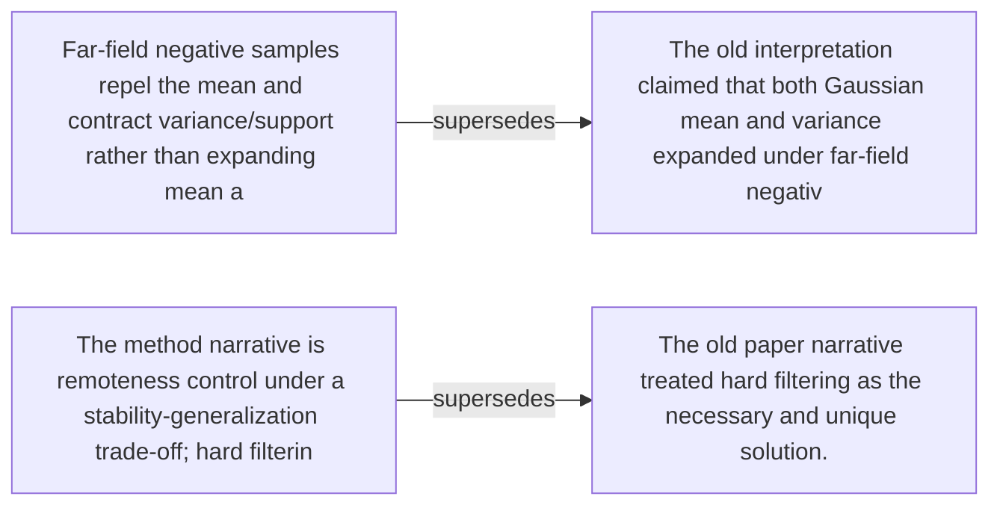

# Generated Claim and Module Lineage View

Graph hash: `5a9848863a418febe2b3f3c2d8df68bf2f4ba4de04744acd111a4fbc177407d8`

> Generated from accepted supersedes edges. Do not edit manually.

```mermaid
flowchart LR
  n_2acd5ee67481["The old paper narrative treated hard filtering as the necessary and unique solution."]
  n_e417e4e82562["The old interpretation claimed that both Gaussian mean and variance expanded under far-field negativ"]
  n_43ab1a1393ad["Far-field negative samples repel the mean and contract variance/support rather than expanding mean a"]
  n_19b9968ab5ef["The method narrative is remoteness control under a stability-generalization trade-off; hard filterin"]
  n_43ab1a1393ad -->|supersedes| n_e417e4e82562
  n_19b9968ab5ef -->|supersedes| n_2acd5ee67481
```
