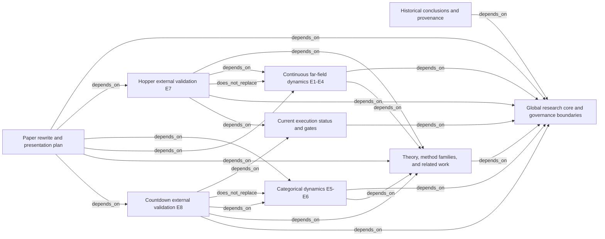

# Generated Stage 4 Semantic Module Overview

Graph hash: `5a9848863a418febe2b3f3c2d8df68bf2f4ba4de04744acd111a4fbc177407d8`

> Generated from the canonical semantic graph. Do not edit manually.

```mermaid
flowchart LR
  n_7cf021b20e43["Categorical dynamics E5-E6"]
  n_0e70552a09db["Continuous far-field dynamics E1-E4"]
  n_b81dc2367b55["Countdown external validation E8"]
  n_787d5627e53b["Current execution status and gates"]
  n_ee5372a9d449["Global research core and governance boundaries"]
  n_050443c8e0f2["Historical conclusions and provenance"]
  n_325f60137591["Hopper external validation E7"]
  n_9d4f8b29ddf7["Paper rewrite and presentation plan"]
  n_1d7f559a0d9e["Theory, method families, and related work"]
  n_1d7f559a0d9e -->|depends_on| n_ee5372a9d449
  n_7cf021b20e43 -->|depends_on| n_ee5372a9d449
  n_325f60137591 -->|depends_on| n_1d7f559a0d9e
  n_b81dc2367b55 -->|depends_on| n_787d5627e53b
  n_b81dc2367b55 -->|does_not_replace| n_7cf021b20e43
  n_b81dc2367b55 -->|depends_on| n_7cf021b20e43
  n_325f60137591 -->|depends_on| n_0e70552a09db
  n_9d4f8b29ddf7 -->|depends_on| n_ee5372a9d449
  n_787d5627e53b -->|depends_on| n_ee5372a9d449
  n_9d4f8b29ddf7 -->|depends_on| n_325f60137591
  n_7cf021b20e43 -->|depends_on| n_1d7f559a0d9e
  n_9d4f8b29ddf7 -->|depends_on| n_7cf021b20e43
  n_9d4f8b29ddf7 -->|depends_on| n_0e70552a09db
  n_050443c8e0f2 -->|depends_on| n_ee5372a9d449
  n_b81dc2367b55 -->|depends_on| n_1d7f559a0d9e
  n_0e70552a09db -->|depends_on| n_ee5372a9d449
  n_0e70552a09db -->|depends_on| n_1d7f559a0d9e
  n_b81dc2367b55 -->|depends_on| n_ee5372a9d449
  n_9d4f8b29ddf7 -->|depends_on| n_1d7f559a0d9e
  n_325f60137591 -->|does_not_replace| n_0e70552a09db
  n_325f60137591 -->|depends_on| n_ee5372a9d449
  n_325f60137591 -->|depends_on| n_787d5627e53b
  n_9d4f8b29ddf7 -->|depends_on| n_b81dc2367b55
```
