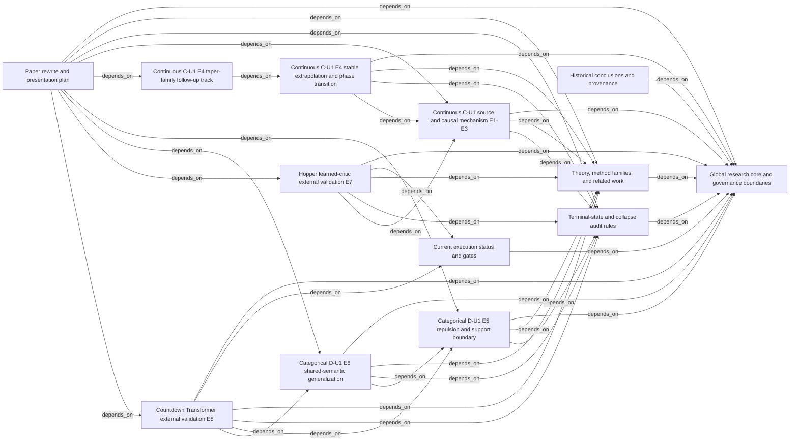

# Stage 4 Minimal Context Dependency Graph

> Generated shadow view. `docs/handoff.md` remains authoritative.

```mermaid
flowchart LR
  global_core_governance["Global research core and governance boundaries"]
  execution_status_gates["Current execution status and gates"]
  theory_methods_related_work["Theory, method families, and related work"]
  terminal_audit["Terminal-state and collapse audit rules"]
  continuous_mechanism_e1_e3["Continuous C-U1 source and causal mechanism E1-E3"]
  continuous_e4_extrapolation["Continuous C-U1 E4 stable extrapolation and phase transition"]
  continuous_e4_taper["Continuous C-U1 E4 taper-family follow-up track"]
  categorical_e5_mechanism["Categorical D-U1 E5 repulsion and support boundary"]
  categorical_e6_generalization["Categorical D-U1 E6 shared-semantic generalization"]
  hopper_e7["Hopper learned-critic external validation E7"]
  countdown_e8["Countdown Transformer external validation E8"]
  history_provenance["Historical conclusions and provenance"]
  paper_rewrite["Paper rewrite and presentation plan"]
  execution_status_gates -->|depends_on| global_core_governance
  theory_methods_related_work -->|depends_on| global_core_governance
  terminal_audit -->|depends_on| global_core_governance
  continuous_mechanism_e1_e3 -->|depends_on| global_core_governance
  continuous_mechanism_e1_e3 -->|depends_on| theory_methods_related_work
  continuous_mechanism_e1_e3 -->|depends_on| terminal_audit
  continuous_e4_extrapolation -->|depends_on| global_core_governance
  continuous_e4_extrapolation -->|depends_on| theory_methods_related_work
  continuous_e4_extrapolation -->|depends_on| terminal_audit
  continuous_e4_extrapolation -->|depends_on| continuous_mechanism_e1_e3
  continuous_e4_taper -->|depends_on| continuous_e4_extrapolation
  categorical_e5_mechanism -->|depends_on| global_core_governance
  categorical_e5_mechanism -->|depends_on| theory_methods_related_work
  categorical_e5_mechanism -->|depends_on| terminal_audit
  categorical_e6_generalization -->|depends_on| global_core_governance
  categorical_e6_generalization -->|depends_on| theory_methods_related_work
  categorical_e6_generalization -->|depends_on| terminal_audit
  categorical_e6_generalization -->|depends_on| categorical_e5_mechanism
  hopper_e7 -->|depends_on| global_core_governance
  hopper_e7 -->|depends_on| execution_status_gates
  hopper_e7 -->|depends_on| theory_methods_related_work
  hopper_e7 -->|depends_on| terminal_audit
  hopper_e7 -->|depends_on| continuous_mechanism_e1_e3
  countdown_e8 -->|depends_on| global_core_governance
  countdown_e8 -->|depends_on| execution_status_gates
  countdown_e8 -->|depends_on| theory_methods_related_work
  countdown_e8 -->|depends_on| terminal_audit
  countdown_e8 -->|depends_on| categorical_e5_mechanism
  countdown_e8 -->|depends_on| categorical_e6_generalization
  history_provenance -->|depends_on| global_core_governance
  paper_rewrite -->|depends_on| global_core_governance
  paper_rewrite -->|depends_on| theory_methods_related_work
  paper_rewrite -->|depends_on| terminal_audit
  paper_rewrite -->|depends_on| continuous_mechanism_e1_e3
  paper_rewrite -->|depends_on| continuous_e4_taper
  paper_rewrite -->|depends_on| categorical_e5_mechanism
  paper_rewrite -->|depends_on| categorical_e6_generalization
  paper_rewrite -->|depends_on| hopper_e7
  paper_rewrite -->|depends_on| countdown_e8
```
